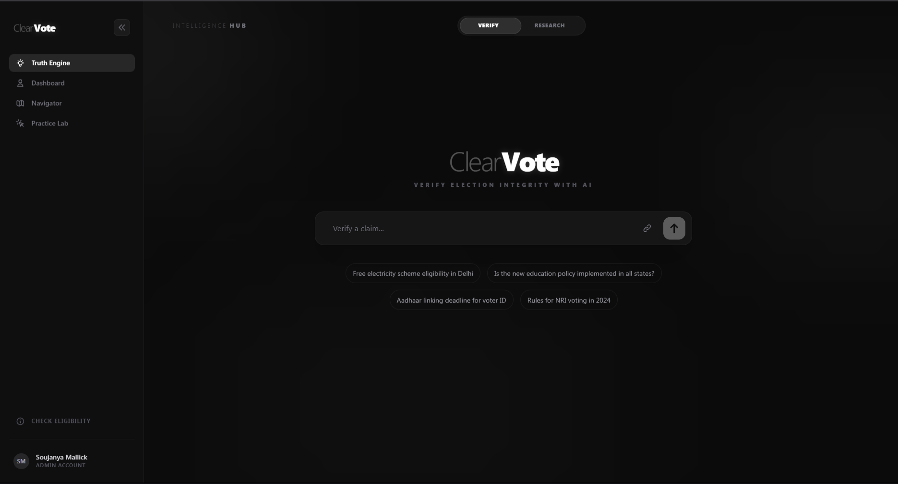
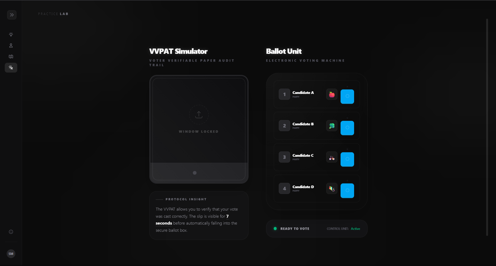
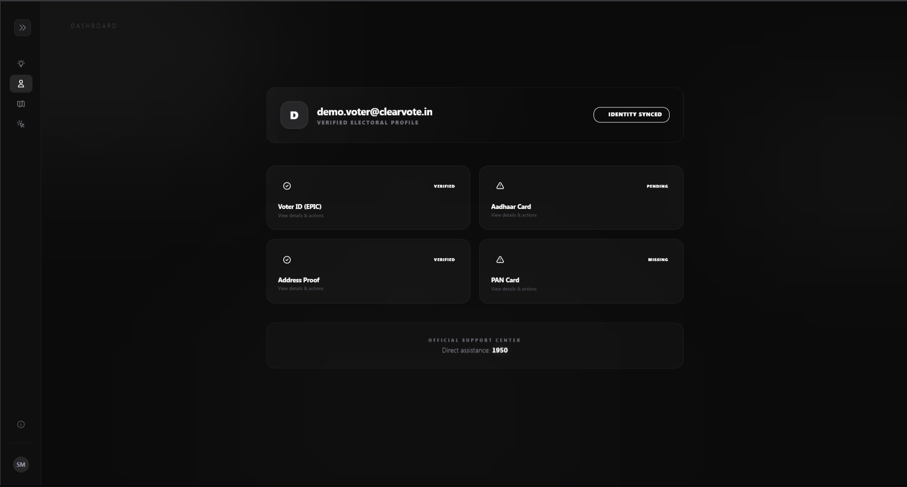
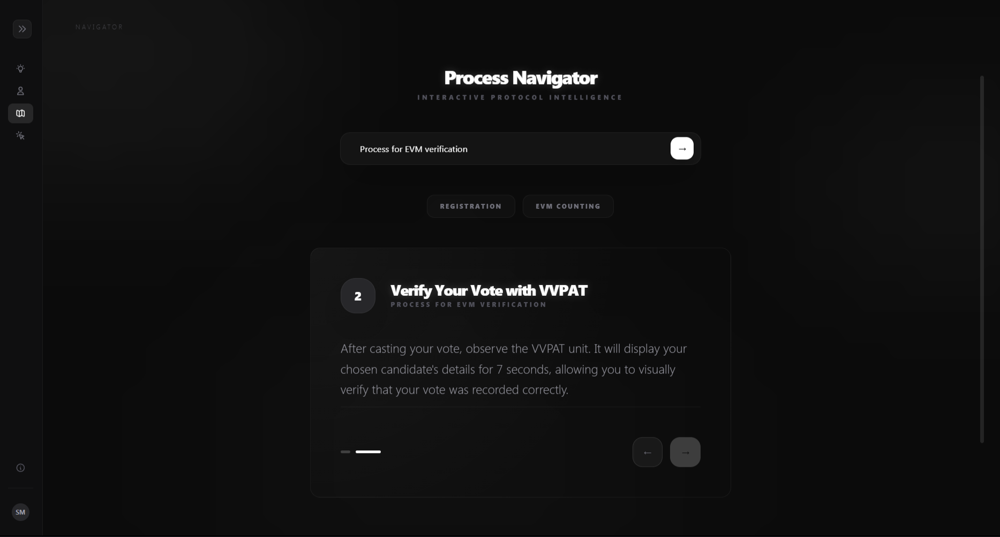

# ClearVote 🗳️
### The Impartial Election Process Integrity Engine

**ClearVote** is an AI-powered verification platform designed to ensure election process education and logistical integrity. Built for the modern voter, it separates official ground truth from misinformation using high-fidelity scraping and state-of-the-art generative AI.

🔗 **Live Demo**: [https://clearvote-kcicx7nepq-el.a.run.app/](https://clearvote-kcicx7nepq-el.a.run.app/)



---

## 🚀 The Four Pillars of ClearVote

### 1. 🔍 Truth Engine (The Intelligence Hub)
A real-time verification tool that uses **Gemini 2.0 Flash** and **Puppeteer** to:
- **Verify Mode**: Instantly check election claims against official ECI (Election Commission of India) portals.
- **Research Mode**: Deep-dive into election protocols, rules, and historical context.
- **Ground Truth snippets**: Provide cited verdicts (True, False, Misleading) with actual source evidence.


### 2. 🧪 Practice Lab (Interactive Simulation)
A hands-on simulator designed to demystify the voting process:
- **VVPAT Simulator**: Experience the 7-second verification window where you see your vote printed.
- **Ballot Unit**: Practice selecting candidates and casting votes in a safe, educational environment.
- **Protocol Insight**: Real-time explanations of why each step exists in a real polling booth.



### 3. 🛡️ Electoral Readiness Dashboard (Readiness Vault)
A DigiLocker-inspired dashboard that ensures you are legally ready to vote:
- **Identity Sync**: Verify essential documentation (Aadhaar, PAN, EPIC).
- **Booth Allocation**: Track your electoral readiness and find your assigned polling station.
- **Personalized Profile**: Dynamic "Verified Account" status for users who complete the onboarding.



### 4. 🗺️ Process Navigator (Interactive Education)
Guided, step-by-step interactive flows for complex electoral tasks:
- **Registration**: Understanding Form 6, BLO verification, and roll inclusion.
- **Polling Day Rights**: Knowing your rights inside the booth, including secrecy of ballot and challenged votes.


---

## ✨ Premium UI & UX

- **Collapsible Sidebar**: A sleek, space-efficient navigation system that adapts to your workflow.
- **Floating Pill Header**: A modern, translucent navigation bar that maximizes content visibility.
- **Advanced Accessibility**: Full ARIA support, keyboard navigation, and semantic HTML for screen reader maturity.
- **Testing Maturity**: Comprehensive test suite covering edge cases, scraper timeouts, and integration flows.
- **Stealth Scrollbars**: Invisible yet functional scrolling for a truly immersive interface.

---

## 🛠️ Tech Stack

- **Framework**: [Next.js](https://nextjs.org/) (App Router)
- **AI Engine**: [Google Gemini 2.0 Flash](https://ai.google.dev/)
- **Scraper**: [Puppeteer](https://pptr.dev/) (Headless Chromium)
- **Authentication**: [Firebase Auth](https://firebase.google.com/) & [DigiLocker Integration](https://www.digilocker.gov.in/)
- **Styling**: Tailwind CSS (Custom Design System with Glassmorphism)

---

## ⚙️ Setup & Installation

### 1. Clone the repository
```bash
git clone https://github.com/Soujanya-Mctrl/clearvote.git
cd clearvote
```

### 2. Install dependencies
```bash
npm install
```

### 3. Configure Environment Variables
Create a `.env` file in the root directory:
```env
GEMINI_API_KEY=your_gemini_api_key

# Firebase (Optional for Demo Mode)
NEXT_PUBLIC_FIREBASE_API_KEY=your_key
NEXT_PUBLIC_FIREBASE_AUTH_DOMAIN=your_domain
NEXT_PUBLIC_FIREBASE_PROJECT_ID=your_id
NEXT_PUBLIC_FIREBASE_STORAGE_BUCKET=your_bucket
NEXT_PUBLIC_FIREBASE_MESSAGING_SENDER_ID=your_sender_id
NEXT_PUBLIC_FIREBASE_APP_ID=your_app_id
```

### 4. Run the development server
```bash
npm run dev
```
Open [http://localhost:3000](http://localhost:3000) to explore ClearVote.

---

## 🛡️ Process Integrity Protocol
ClearVote is built on a foundation of strict impartiality. Our AI engine is instructed to prioritize **Official ECI Handbooks** and **Ground Truth Sources** over subjective commentary, ensuring that every verdict is rooted in the actual mechanics of the election process.

---
*Developed for the Election Process Education Hackathon.*
